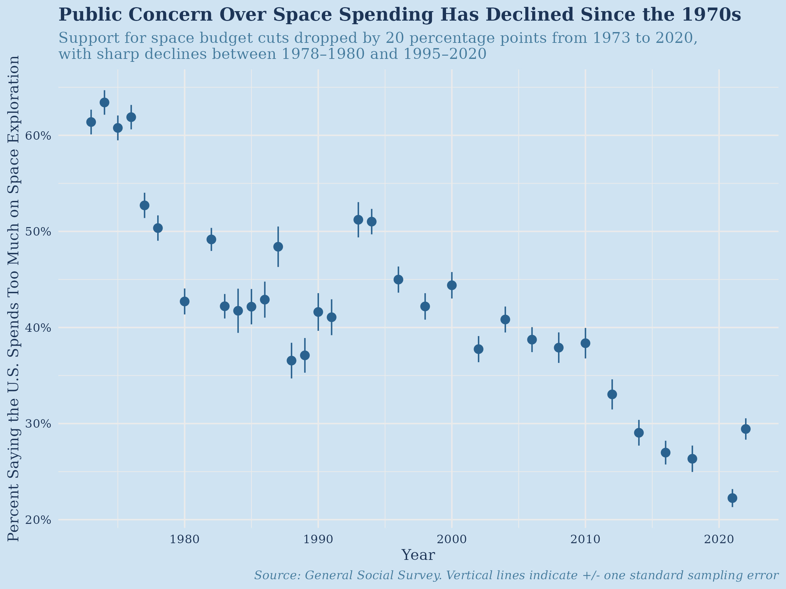

# General Social Survey Analysis in R

This project analyzes public opinion toward U.S. spending on space exploration using data from the General Social Survey (GSS).

The project was completed in R as part of my statistics coursework and focuses on data cleaning, exploratory data analysis, logistic regression, model assessment, and changes in predictor effects across survey years.

## Research Question

How have Americans' opinions about U.S. spending on space exploration changed over time, and what demographic factors are associated with believing that the United States spends too much on space exploration?

## Dataset

The analysis uses data from the General Social Survey (GSS), covering survey years from 1972 through 2022.

The primary response variable is `natspac`, which measures respondents' opinions regarding U.S. spending on space exploration.

For the logistic regression analysis, responses were converted into a binary outcome:

- `1` = respondent believes the U.S. spends **too much** on space exploration
- `0` = respondent believes spending is **about right** or **too little**

Responses that were missing, inapplicable, or could not be classified were excluded from the analysis.

## Methods

The project was completed in R using packages including:

- `tidyverse`
- `ggplot2`
- `readxl`
- `scales`
- `broom`

The analysis included:

- Data cleaning and recoding
- Calculation of proportions and standard sampling errors
- Data visualization with `ggplot2`
- Multiple logistic regression
- Comparison of candidate models using AIC and residual deviance
- Binned residual analysis for model assessment
- Regression coefficient comparisons across GSS survey years

## Predictors

Predictors considered in the analysis included:

- Age group
- Education level
- Sex
- Social class
- Political ideology

Several candidate logistic regression models were compared before selecting a final model using age, education, sex, and social class.

## Key Findings

The analysis showed a substantial long-term decline in the percentage of respondents who believe the United States spends too much on space exploration.

In the 1970s, more than half of respondents in some survey years reported that the U.S. was spending too much. By 2022, that proportion had fallen to approximately one quarter of respondents.

The regression analysis also suggested that:

- Education level was consistently associated with opinions about space spending.
- Differences by sex changed over time.
- Age showed some persistent differences in attitudes.
- Social class generally had a weaker and less consistent relationship with the response.

A final time-series analysis fit the logistic regression model separately across GSS survey years to examine how demographic associations changed over time.

## Example Visualization

The points represent the estimated proportion of respondents who believed that the U.S. spent too much on space exploration. Vertical ranges represent approximately one standard sampling error.

## Files

- `gss_space_spending_analysis.qmd` — R/Quarto source code and written analysis
- `gss_space_spending_analysis.pdf` — rendered project report
- `part1_plot.jpg` — example visualization from the analysis

## Skills Demonstrated

This project demonstrates experience with:

- R
- Data cleaning and transformation
- Survey data analysis
- Statistical visualization
- Logistic regression
- Model selection
- Model diagnostics
- Sampling error
- Reproducible analysis with Quarto
